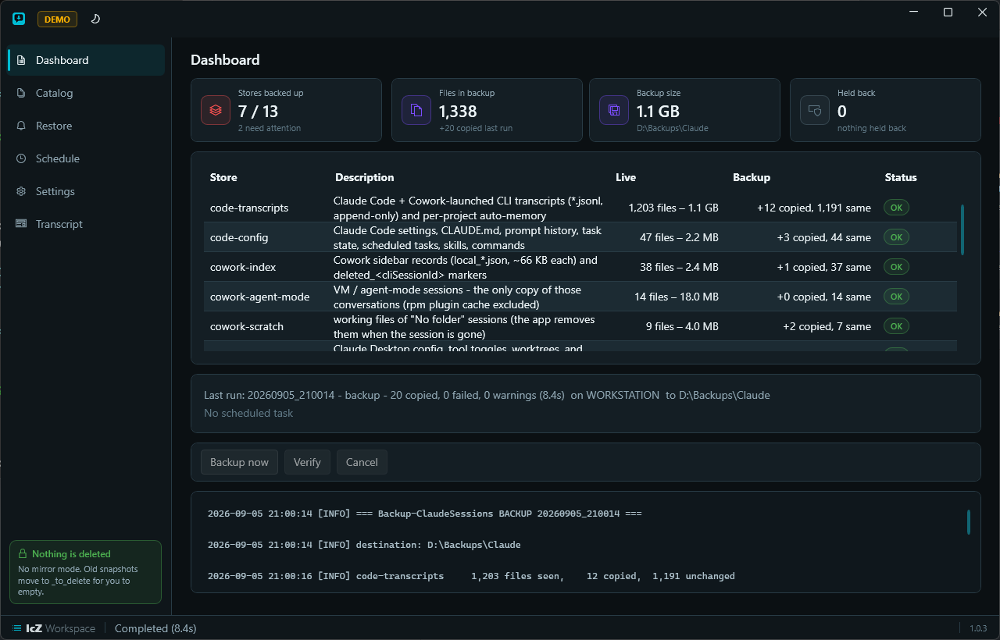
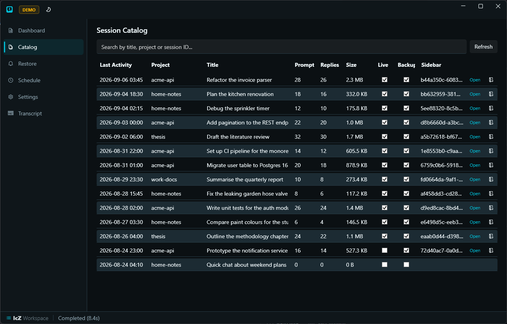
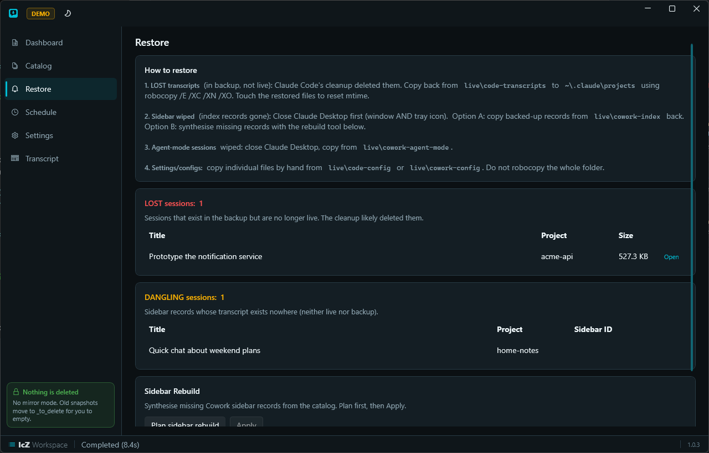
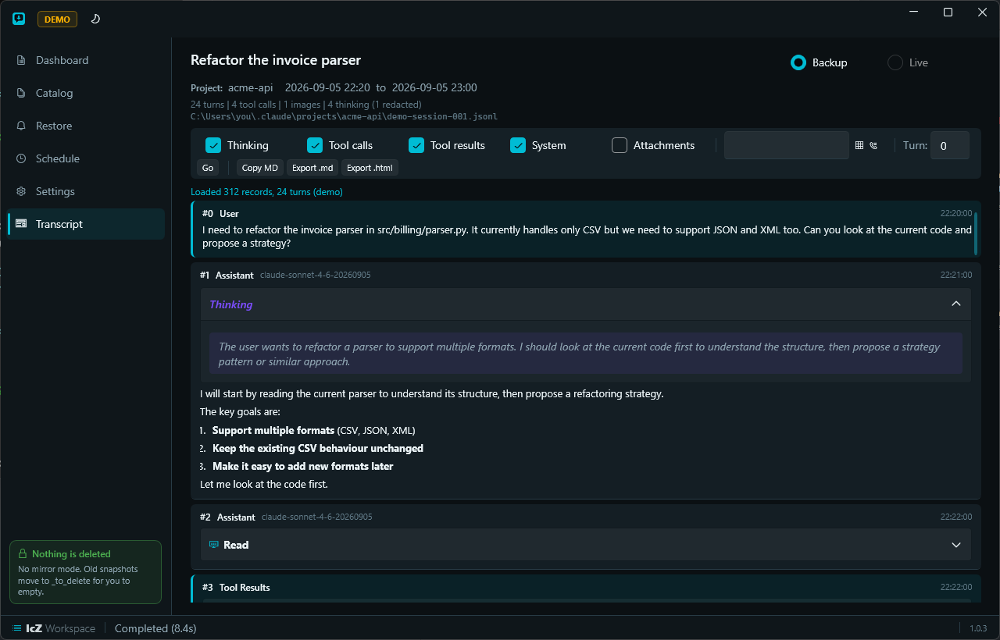
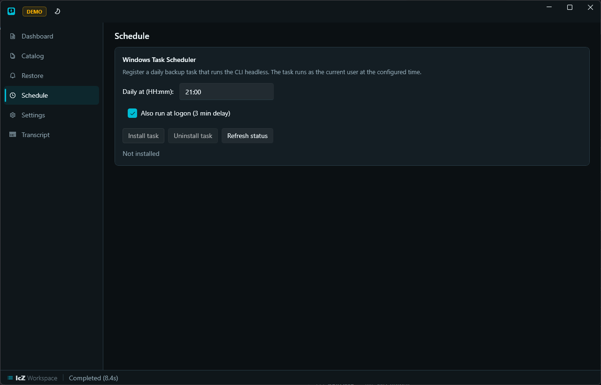
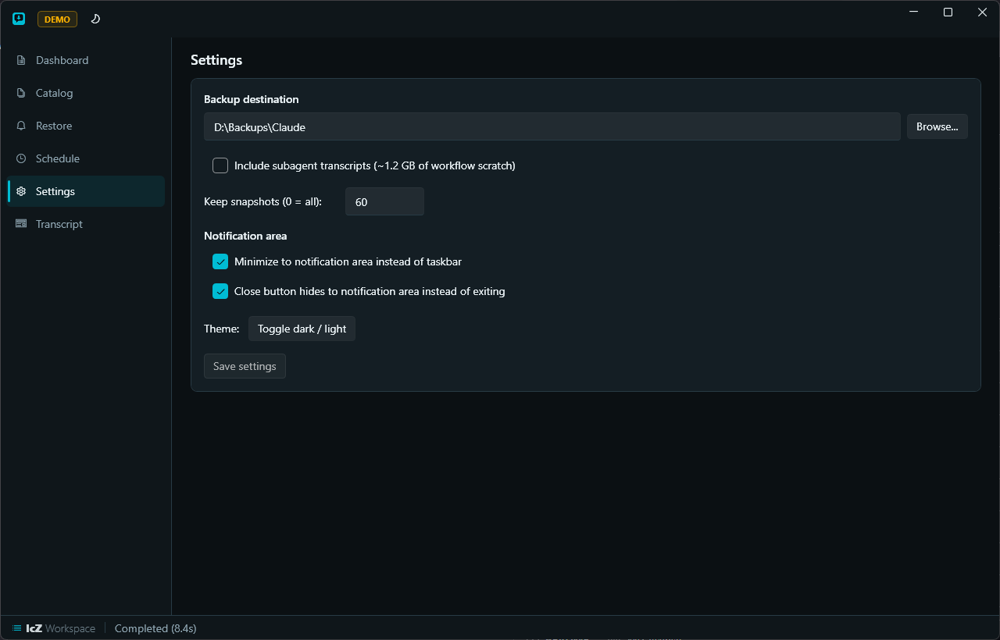
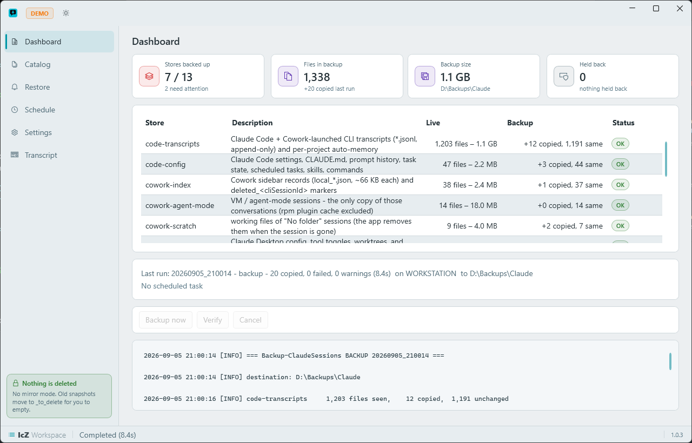

# ClaudeSessionBackup

Backup tools for Claude. A Windows desktop app plus headless CLI that backs up every conversation store
Claude Desktop (Cowork) and Claude Code keep on this machine into a folder neither app touches, keeps a
session catalog, and can rebuild a wiped Cowork sidebar from that catalog.

The C# tool is the authoritative implementation.

```
src/ClaudeSessionBackup.Core/   engine - UI-free, WPF-free, shared by App and Cli
src/ClaudeSessionBackup.App/    WPF desktop shell (WPF-UI 4.3, CM2 theme, "ClaudeSessionBackup.exe")
src/ClaudeSessionBackup.Cli/    headless runner - what Task Scheduler calls ("ClaudeSessionBackup.Cli.exe")
tests/ClaudeSessionBackup.Tests xunit (engine, catalog, rebuild, CLI, transcripts) - 176 tests, temp trees only
tools/                          Verify.ps1 (7 gates), Capture-Screenshots.ps1, Package.ps1, Make-Installer.ps1,
                                Check-Packaging.ps1, Check-Privacy.ps1, Release.ps1, ClaudeSessionBackup.iss,
                                icon_source.py + build_icon.py
.github/workflows/              ci.yml (build, tests, Check-Packaging, Check-Privacy on push to main and on PRs)
                                release.yml (tag-triggered: builds zip + Setup.exe, attaches to Release)
```

## Why

| Threat | What it deletes | Seen on this machine |
|---|---|---|
| Claude Desktop `cleanupVMBundleIfUnsupported` | `%APPDATA%\Claude\claude-code-sessions` (sidebar index) and `local-agent-mode-sessions` (VM sessions) | 2026-08-22, sidebar wiped |
| Claude Code auto-cleanup (`cleanupPeriodDays`, default 30, keyed on file **mtime**) | `~\.claude\projects\**\*.jsonl` transcripts, silently, at CLI start | pre-Aug-22 transcripts were re-stamped 2026-08-29 and enter the window ~2026-09-28 |

`cleanupPeriodDays` is set to 3650 in `~\.claude\settings.json`, but deletion has been reported despite a
high value (anthropics/claude-code#62476). The backup is the protection.

## Screenshots

The screenshots below are captured from the app running in demo mode (`--demo`, fictional data) by
`tools\Capture-Screenshots.ps1 -Demo`. The demo marker at `docs\screenshots\.demo` is verified by
`tools\Check-Privacy.ps1` (gate 7): it records each screenshot's SHA-256, so a screenshot that did not come out of demo mode fails the gate and no real session data enters a tracked file.

Dashboard after a backup run - the thirteen stores, live and backup counts, status, the run log:



Catalog - every session with its title, project, prompts and replies, size, and whether the transcript exists live and in the backup:



Restore - the restore guide, LOST and DANGLING lists, and the sidebar rebuild plan (7 records would be written here):



Transcript - a session read from the backup copy: prompts, replies, thinking, tool calls:



Schedule and Settings:

| | |
|---|---|
|  |  |

Light theme:



## The app

Six pages behind a nav rail, dark/light CM2 theme, single instance. Run with `--demo` for a fictional
dataset (no live stores read):

* **Dashboard** - the thirteen stores with live vs backup counts and a status pill, Backup now / Verify / Cancel,
  last-run summary, scheduled-task status, and the run log.
* **Catalog** - every session (title, project, prompts/replies, size, live, backup, sidebar record), search,
  LOST / DANGLING / deleted-in-app flags, open a transcript's folder. Open a session to view its transcript.
* **Restore** - the LOST and DANGLING lists, the restore guide, and the sidebar rebuild: plan (dry run) then
  apply; apply refuses while Claude Desktop is running. Open a session to view its transcript.
* **Transcript** - opens from the Catalog or Restore "Open" button; reads the backup or live transcript copy
  with toggles for thinking, tool calls, tool results, system, and attachments; text search with next/prev;
  jump to turn; images decoded inline; copy Markdown or export to .md/.html.
* **Schedule** - daily time, at-logon trigger, install / uninstall the Windows scheduled task, its status.
* **Settings** - destination, include subagents, snapshot retention, theme.

A fault while the window loads is written to `%APPDATA%\ClaudeSessionBackup\startup-error.log` and the
process exits (no invisible instance holding the single-instance mutex).

## Stores (source -> `<destination>\live\<name>`)

| name | source | notes |
|---|---|---|
| `code-transcripts` | `~\.claude\projects` | `*.jsonl` transcripts (append-only) + per-project auto-memory; `subagents\` excluded unless "include subagents" |
| `code-config` | `~\.claude` | whitelist: `settings.json`, `settings.local.json`, `CLAUDE.md`, `history.jsonl`, `statusline.js`, `keybindings.json`; dirs `tasks`, `scheduled-tasks`, `skills`, `commands`, `plans`, `todos`, `agents`, `hooks`. **Never** `.credentials.json` / `.claude.json` |
| `cowork-index` | `%APPDATA%\Claude\claude-code-sessions` | sidebar records `local_*.json` + `deleted_<cliSessionId>` markers |
| `cowork-agent-mode` | `%APPDATA%\Claude\local-agent-mode-sessions` | VM / agent-mode sessions; `rpm\` excluded |
| `cowork-scratch` | `%APPDATA%\Claude\scratch-workspaces` | working files of "No folder" sessions |
| `cowork-config` | `%APPDATA%\Claude` | whitelist of config files + `logs\` |
| `cowork-logs` | `%LOCALAPPDATA%\Claude\Logs` | the desktop app's live logs (`main.log` recorded the Aug-22 wipe, `mcp-*.log`, `cowork_vm_node.log`); the `%APPDATA%` copy stopped on 2026-08-22 |
| `cowork3p-index` | `%LOCALAPPDATA%\Claude-3p\claude-code-sessions` | sidebar records of the second Claude Desktop profile (dormant since 2026-08-14) |
| `cowork3p-agent-mode` | `%LOCALAPPDATA%\Claude-3p\local-agent-mode-sessions` | that profile's VM / agent-mode store; `rpm\` excluded. Its root holds `host-creds-*.json` and is deliberately NOT a store |
| `msix-index` | `%LOCALAPPDATA%\Packages\Claude_*\LocalCache\Roaming\Claude\claude-code-sessions` | sidebar records of the packaged (Store) Claude Desktop; **Optional** - absent when the Store app is not installed |
| `msix-agent-mode` | `%LOCALAPPDATA%\Packages\Claude_*\LocalCache\Roaming\Claude\local-agent-mode-sessions` | VM / agent-mode sessions in the MSIX container; `rpm\` excluded; **Optional** |
| `msix-scratch` | `%LOCALAPPDATA%\Packages\Claude_*\LocalCache\Roaming\Claude\scratch-workspaces` | scratch workspaces in the MSIX container; **Optional** |
| `msix-config` | `%LOCALAPPDATA%\Packages\Claude_*\LocalCache\Roaming\Claude` | config and logs of the packaged Claude Desktop's container profile; **Optional** |

Destination default `%USERPROFILE%\Claude\_claude_sessions_backup\`: `live\`, `snapshots\<stamp>_claude-stores.zip`,
`catalog\sessions_catalog.json|.md|.previous.json`, `logs\`, `quarantine\`, `_to_delete\`, `backup.log`, `last_run.json`.

## Safety rules (the engine's contract, `Core/Engine/BackupEngine.cs`)

1. Never deletes or truncates at the destination. An empty source next to a non-empty backup is reported as a wipe, not mirrored.
2. Shrink guard: a transcript smaller at the source than in the backup is held back and quarantined.
3. Copies go to a `.partial` name and are moved into place; cancellation sweeps partials; a crash never leaves a half file that looks valid.
4. Snapshots beyond the retention count are moved to `_to_delete`, never deleted; a snapshot that fails to write is removed.
5. Secrets are never copied.
6. The sidebar rebuild refuses to write while the desktop app runs, backs the index folder up first, and never resurrects app-deleted sessions unless asked. Deleted markers are read from the live index AND the backup copy.
7. One run at a time per destination (`.lock`, stale after 3 h); closing the app mid-run cancels the run first.
8. Store discovery: every backup and verify run scans for Claude data roots not inside any covered store (MSIX container folders, unexpected local-data roots, session-store folder names up to 6 levels deep) and logs a WARN per uncovered root; results appear in `last_run.json` and on the Dashboard.
9. Shared-destination warning: `last_run.json` records the machine name of each run. If the next run comes from a different machine, it logs a WARN — two machines writing the same destination stomp each other's catalog and run log.

## CLI

```
ClaudeSessionBackup.Cli backup        [--destination D] [--include-subagents] [--no-snapshot] [--no-catalog] [--keep-snapshots N] [--quiet]
ClaudeSessionBackup.Cli verify        [--destination D] [--include-subagents] [--quiet]
ClaudeSessionBackup.Cli catalog       [--destination D] [--include-subagents] [--no-cache] [--report] [--quiet]
ClaudeSessionBackup.Cli rebuild       --catalog F [--commit] [--out-dir D] [--index-root R] [--index-dir D] [--donor F] [--backup-index D]
                                      [--include-empty] [--include-subagents] [--include-cli] [--include-deleted] [--force] [--quiet]
ClaudeSessionBackup.Cli export        (--session <id-or-prefix> | --file <path.jsonl>) [--source backup|live] [--destination D] [--format md|html] [--out F] [--no-thinking] [--no-tools] [--no-results] [--no-system] [--attachments] [--no-images] [--max-result-chars N] [--quiet]
ClaudeSessionBackup.Cli install-task  [--time HH:mm] [--no-logon] [--destination D] [--include-subagents]
ClaudeSessionBackup.Cli uninstall-task
ClaudeSessionBackup.Cli task-status
```

Exit codes: 0 ok, 1 ok with warnings, 2 failures, 3 usage/config error, 4 refused (lock held, or desktop app running for `rebuild --commit`).
Options default to `%APPDATA%\ClaudeSessionBackup\settings.json`, which the app's Settings page writes.

The scheduled task runs `ClaudeSessionBackup.Cli.exe backup --destination "<dest>" --quiet` daily and 3 minutes after logon,
as the interactive user, least privilege, 2 h limit, no overlapping instances.

## Build and verify

```
dotnet build ClaudeSessionBackup.slnx -c Release
dotnet test  ClaudeSessionBackup.slnx -c Release
powershell -ExecutionPolicy Bypass -File .\tools\Verify.ps1
```

Seven gates: build (0 errors, nullable warnings are errors), tests, CLI smoke (verify, backup, catalog, rebuild dry run against a temp destination — read-only on the live stores), theme-key parity, launch gate (window CLASS `HwndWrapper[...]`, not a `#32770` dialog; startup-error.log must not appear), packaging (Check-Packaging.ps1 static checks, then a framework-dependent Package.ps1 + Make-Installer.ps1 dry build into a temp folder, never into `dist`), and privacy (Check-Privacy.ps1 scans every tracked text file for the denylist and verifies every screenshot against the SHA-256 recorded in the `.demo` marker).

The launch gate checks that no `startup-error.log` appeared — a clean build proves nothing about XAML resource resolution. Close the app before building: a running exe locks the App project's output.

Icon: `python tools\icon_source.py && python tools\build_icon.py` regenerates `src\ClaudeSessionBackup.App\Assets\app.ico`
(a speech bubble with a cut-out down-arrow on the CM2 accent tile; 16 px is the design target). The
per-size renders under `build\icon\` are intermediates and are git-ignored.

## Install

### Quick start (installer)

Download `ClaudeSessionBackup-1.0.2-Setup.exe` from the repository's **Releases page** and run it.

The wizard installs per-user to `%LOCALAPPDATA%\Programs\ClaudeSessionBackup` — no administrator rights
needed or requested. It creates a Start Menu entry; the desktop shortcut and the daily backup task are
both **unticked by default** so you only get what you ask for. It registers a proper entry in
**Settings > Apps & features** so upgrades install in place and the uninstaller is always at hand. If the
app is running when you launch the installer, it waits for you to close it before copying files.

**SmartScreen will warn on the first run.** The installer is unsigned, so Windows shows
"Windows protected your PC". Click **More info** → **Run anyway**. Only an Authenticode certificate
removes that; the warning fades as the same file builds reputation on more machines.

The installer is self-contained — no .NET installation required.

| | what you need | what you get |
|---|---|---|
| **Setup.exe** | nothing else | per-user install, Start Menu entry, Apps & features entry, in-place upgrades |
| **zip** | nothing else to run; .NET SDK to build | extract anywhere, run `Install.cmd` — same per-user result |
| **from source** | .NET SDK 8.0+ | `Install.ps1` builds and installs in one step |

### Quick start (zip)

1. Download `ClaudeSessionBackup-1.0.2-win-x64.zip` from the Releases page.
2. Right-click the zip > **Properties** > tick **Unblock** > OK. (Windows marks
   downloaded archives as blocked; unblocking before extracting clears the mark on
   all files inside. Unblocking after extraction does not.)
3. Extract anywhere.
4. Double-click **Install.cmd**.

The app installs for you only, under `%LOCALAPPDATA%\Programs\ClaudeSessionBackup`,
with a Start Menu shortcut. No administrator rights are needed or requested.

### From source

```
powershell -ExecutionPolicy Bypass -File .\Install.ps1
```

Requires the .NET SDK 8.0 or newer. Both projects are published into the same folder
so `ClaudeSessionBackup.Cli.exe` resolves beside `ClaudeSessionBackup.exe` (the Schedule
page looks for it there).

### Scheduled task (optional, off by default)

The Schedule page inside the app lets you register and uninstall the daily backup task
interactively. To register it at install time, add `-RegisterTask`:

```
powershell -ExecutionPolicy Bypass -File .\Install.ps1 -RegisterTask
```

### Uninstall

**Settings > Apps > Claude Session Backup > Uninstall**, or:

```
powershell -ExecutionPolicy Bypass -File .\Uninstall.ps1
```

The uninstaller removes the application, shortcuts, and scheduled task. It deliberately
does **not** touch your backup destination or your settings
(`%APPDATA%\ClaudeSessionBackup`), so a reinstall picks up your configuration straight away.
Delete those by hand if you want them gone too.

### Build the installer yourself

Build both artefacts from one publish, in this order:

```
powershell -ExecutionPolicy Bypass -File .\tools\Package.ps1
```

```
powershell -ExecutionPolicy Bypass -File .\tools\Make-Installer.ps1 -SkipPackage
```

`Package.ps1` produces `dist\ClaudeSessionBackup-1.0.2-win-x64.zip` (self-contained, ~65 MB).
Running it first and then pointing `Make-Installer.ps1 -SkipPackage` at that exact payload is
what guarantees the zip and the Setup.exe are the same build. `Make-Installer.ps1` also writes
`dist\SHA256SUMS.txt` for both files (LF line endings, the format `sha256sum -c` reads).

`Make-Installer.ps1` requires Inno Setup once:

```
winget install JRSoftware.InnoSetup
```

Both scripts accept `-FrameworkDependent` for a ~5 MB result that requires .NET Desktop Runtime 8.0+
already present. The self-contained default is deliberate: 65 MB is a one-off download;
"it says .NET is missing" is a support conversation with someone who is trying to save their sessions.

### Cutting a release

```
powershell -ExecutionPolicy Bypass -File .\tools\Release.ps1 -Version x.y.z
```

The script bumps the version, then prints the git commands (add, commit, tag) and asks
y/N to run them. It never pushes on its own — after answering y, push with
`git push origin <branch> --tags`. `RELEASE_NOTES.md` must have a
`# Claude Session Backup x.y.z` heading before you run it — the script checks and
stops if it is missing.

Push the tag and the release workflow (`.github\workflows\release.yml`) runs on GitHub's
Windows runner: it builds the zip and Setup.exe, computes `SHA256SUMS.txt`, and attaches
all three to the Release page automatically. Releases on a private repo are visible only
to collaborators.

`ci.yml` runs build, tests, `Check-Packaging.ps1`, and `Check-Privacy.ps1` on every push to `main` and on every pull request so regressions are caught before they reach the release workflow.

## Provenance

Built 2026-09-05 from the verified PowerShell/Python tool. Six components were implemented in parallel by
pinned worker models against fixed contracts (`Core/Model`, the `<remarks>` blocks), integrated, then reviewed
across six lenses with every finding adversarially verified before being fixed. Parity with the reference:
catalog counts identical on 145 sessions; rebuild plan identical (7 records, same donor, same skips).

## License

MIT - see `LICENSE`.
